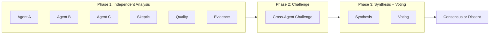
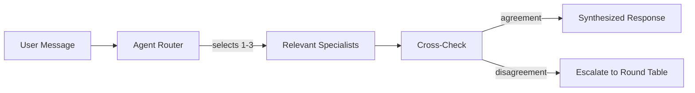
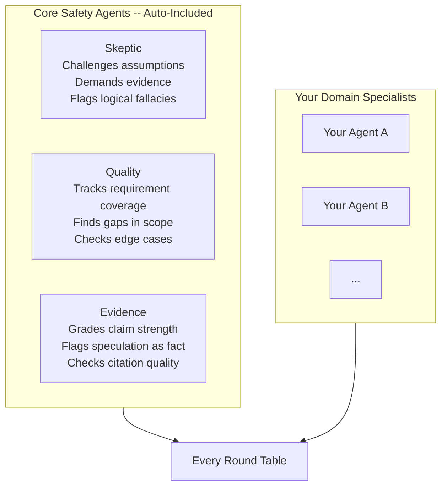
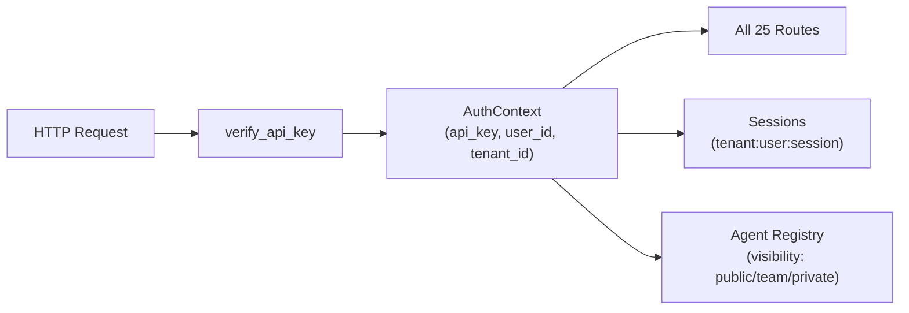

# aiscaffold v3

**AI Agent Platform Scaffold -- Multi-Agent Deliberation with Safety Agents Built In**

Multi-agent systems need structured deliberation and evidence discipline -- or they drift toward overconfident, unsupported claims. This scaffold gives you both from the first command.

One-command scaffold ([copier](https://copier.readthedocs.io/)) for AI agent projects: multi-agent round table with adversarial safety agents, chat orchestrator, HTTP API for agents in any language, prompt caching, adaptive learning, and deployment templates (Docker + Kubernetes).

**Safety-first deliberation** -- Every round table includes five core safety agents by default:
- **Skeptic** -- challenges assumptions, demands evidence, flags logical fallacies
- **Quality** -- tracks requirement coverage, catches gaps across agents
- **Evidence & compliance** -- grades claim strength, flags speculation-as-fact language, enforces evidence-level tagging (VERIFIED/CORROBORATED/INDICATED/POSSIBLE)

**Secure** -- SSRF protection, prompt injection defense, rate limiting, HMAC-SHA256 webhook verification, API key auth with multi-tenancy structural prep.

**Cost-efficient** -- Anthropic/OpenAI/Google prompt caching (~90% savings on cached prefixes per provider pricing), per-call token tracking with budget enforcement.

**Learning** -- Feedback loops, trust scores, human-in-the-loop approval gates.

**Scalable** -- Docker & Kubernetes (HPA, secrets, security context), external agents via HTTP in any language.

*243 tests · 79% coverage · 16-check validation pipeline (ruff, bandit, red team, AI checks, pytest)*

---

## How It Works

### Round Table: 4-Phase Multi-Agent Deliberation



Each agent analyzes the task independently, then agents challenge each other's findings with counter-evidence (not opinions), and finally vote on a synthesized recommendation. Core safety agents participate in every phase.

### Chat Orchestrator: Lightweight Real-Time Interaction



The chat orchestrator routes messages to the most relevant specialists (based on domain matching + trust scores), cross-checks their responses, and escalates to the full round table when confidence is low.

### Core Safety Agents



Core agents are **meta-agents** -- they evaluate *how well* the analysis was done, not *what* was analyzed. They work alongside your domain specialists in every round table by default. Opt out with `include_core_agents=False` if you have a specific reason.

### Evidence Citation Levels

Every agent in a scaffolded project is prompted to cite evidence for findings. The system supports four evidence levels, from strongest to weakest:

| Level | Meaning | Requirement |
|-------|---------|-------------|
| **VERIFIED** | "Direct proof exists at this location" | Must cite specific data source and reference. The system can validate the citation exists. |
| **CORROBORATED** | "Multiple independent sources agree" | Must name at least 2 independent sources. Stronger than any single source alone. |
| **INDICATED** | "Data suggests this, but there are gaps" | Must name the source and acknowledge what data is missing. |
| **POSSIBLE** | "Cannot rule out -- warrants investigation" | Must explain what additional data would confirm or deny the finding. |

**Enforcement pipeline** -- Runs automatically after Phase 1, before Phase 2:
1. **FactChecker** scans for banned patterns: "probably", "I think", "90% confident", "seems to"
2. **EvidenceLevelEnforcer** validates tag format (VERIFIED needs source:ref, CORROBORATED needs 2+ sources)
3. **CitationValidator** checks that cited sources exist (pluggable SourceRegistry)
4. **MathVerifier** validates numeric claims against ground truth (pluggable)

Responses with 3+ critical violations are **rejected and auto-rewritten** via LLM correction prompt (up to 2 retries). The FactChecker and Citation core agents also participate in deliberation to explain *why* violations are problematic.

---

## Quick Start

```bash
pip install copier

copier copy gh:KangaKode/aiscaffold my-project --trust

cd my-project
python3 -m venv venv && source venv/bin/activate
pip install -r requirements.txt
pre-commit install
make test       # Architecture tests pass from day 1
make demo       # See the round table in action (no API keys needed)
make serve      # Start the API gateway
```

---

## What You Get

Every scaffolded project includes **53+ Python source files** across 8 modules:

### Two Interaction Modes

- **Round Table** -- Full 4-phase multi-agent deliberation (Strategy, Independent Analysis, Challenge, Synthesis + Voting). For complex decisions needing all perspectives. Five core safety agents (Skeptic, Quality, Evidence, FactChecker, Citation) participate automatically. Evidence enforcement pipeline runs between Phase 1 and Phase 2.
- **Chat Orchestrator** -- Lightweight real-time chat. A lead agent selectively consults 1-3 specialists, cross-checks for agreement, and escalates to the round table when needed.

### API Gateway (FastAPI)

9 route modules exposing everything over HTTP:

- `POST /api/v1/round-table/tasks` -- Submit task for full multi-agent deliberation
- `GET  /api/v1/round-table/search?q=` -- Semantic search over past deliberations
- `POST /api/v1/chat` -- Send message to chat orchestrator
- `POST /api/v1/chat/stream` -- Same, with Server-Sent Events streaming
- `POST /api/v1/agents` -- Register external agent (any language)
- `GET  /api/v1/agents` -- List registered agents with health status
- `POST /api/v1/feedback` -- Record user feedback signal
- `GET  /api/v1/preferences/search?q=` -- Semantic preference search
- `GET  /api/v1/checkins` -- List pending check-ins
- `GET  /health` -- Liveness, readiness, and metrics

### External Agent Protocol (Any Language)

External agents implement 3 HTTP endpoints:

```
POST /analyze   -- Independent analysis with evidence citations
POST /challenge -- Challenge other agents' findings with counter-evidence
POST /vote      -- Vote on synthesis (approve with conditions, or dissent with reason)
```

The `RemoteAgent` adapter wraps these as `AgentProtocol` -- the round table and chat orchestrator see no difference between local Python agents and remote TypeScript/Go/Rust agents.

### LLM Client with Prompt Caching

Provider-agnostic client (Anthropic, OpenAI, Google) with automatic prompt caching:
- `CacheablePrompt(system, context, user_message)` separates stable prefix from dynamic content
- Anthropic: `cache_control` for ~90% input token savings on cached prefixes
- OpenAI: prefix caching for ~50% savings
- Token tracking per call (input, output, cached, estimated USD cost)
- Budget enforcement with configurable spending limits
- Auto-retry with exponential backoff

### Adaptive Learning System (opt-in)

Teaches your project to learn from user interactions:
- **Feedback Tracker** -- Accept/reject/modify/rate signals per agent
- **Agent Trust** -- EMA-based trust scores that influence agent routing
- **Check-in Manager** -- Never adapts silently; asks permission first
- **User Profile** -- Aggregates preferences into context bundles for LLM prompts
- **RAG** -- ChromaDB vector search over preferences and round table transcripts (in-memory fallback)
- **Graduation** -- Promotes stable patterns to global profile across projects

### Security (Baked In Everywhere)

- SSRF protection on agent registration (blocks private IPs, non-http schemes, cloud metadata endpoints)
- Prompt injection defense (all external agent responses sanitized, injection patterns detected)
- Input size limits on every endpoint
- Rate limiting per client IP with stale-IP eviction and 10K IP hard cap
- HMAC-SHA256 webhook signature verification for async agents
- API key auth with production enforcement (`AuthContext` with multi-tenancy structural prep)
- CORS restricted to configured origins (wildcard rejected)
- DNS TOCTOU limitation documented on URL validation

### Multi-Tenancy Structural Prep

The scaffold includes isolation primitives that make adding multi-tenancy straightforward:



- `AuthContext` propagates `tenant_id` and `user_id` to all routes
- Agent visibility controls: `public` (all tenants), `team` (same tenant), `private`
- Session isolation: `{tenant_id}:{user_id}:{session_id}`
- Data layer already has `project_id` in all tables (maps to tenant isolation)
- Single-tenant deployments use defaults transparently

### Deployment Infrastructure

- **Dockerfile** -- Multi-stage build, non-root user, health check
- **docker-compose.yml** -- App + Postgres, one command to run
- **Kubernetes** -- Deployment (security context, version tags), Service, HPA (auto-scale 2-10 pods), ConfigMap, Secret template

### 14 Development Subagents (`.cursor/agents/`)

Cursor IDE agent definitions that assist during development (not runtime agents):

| Agent | Role |
|-------|------|
| **solution-architect** | Must be consulted before any new feature is coded |
| **codebase-scout** | Searches existing code before allowing new code to be written |
| **data-flow-guardian** | Validates data paths, source of truth, transaction safety |
| **minimalist** | Prevents over-engineering and AI code bloat |
| **code-reviewer** | Quality, security, maintainability review |
| **red-team** | Adversarial pre-commit security gate (BLOCKS on findings) |
| **security-hardener** | Blue team -- proactive defensive security |
| **prompt-engineer** | 2026 Anthropic Skills patterns for prompt design |
| **ai-engineer** | Multi-agent architecture and orchestration |
| **test-architect** | Test strategy, eval design, coverage analysis |
| **debugger** | Systematic root cause analysis |
| **project-curator** | Directory structure and root cleanliness |
| **sql-pro** | Database optimization (conditional on persistence choice) |
| **ux-researcher** | User workflow optimization (conditional on project type) |

---

## Configuration Options

| Option | Default | Description |
|--------|---------|-------------|
| `project_type` | `web-app` | `web-app`, `cli-tool`, `multi-agent`, `api-service` |
| `llm_provider` | `anthropic` | `anthropic`, `openai`, `google`, `multi` |
| `persistence` | `sqlite` | `sqlite`, `postgres`, `none` |
| `include_evals` | `true` | Eval infrastructure |
| `include_state_management` | `true` | Task tracker + progress notes |
| `include_llm_client` | `true` | LLM client with prompt caching |
| `include_api_gateway` | `true` | FastAPI gateway + external agent support |
| `include_deployment` | `true` | Dockerfile, docker-compose, K8s manifests |
| `include_learning` | `false` | Learning system (feedback, trust, preferences, RAG) |

---

## Makefile

```bash
make help          # Show all commands
make test          # Run all tests
make test-arch     # Architecture enforcement
make serve         # Start API gateway (dev mode with auto-reload)
make serve-prod    # Start API gateway (production, 4 workers)
make demo          # Run round table demo (no API keys needed)
make new-agent NAME=my_analyst DOMAIN="code review"  # Scaffold a new agent
make docker-build  # Build Docker image
make docker-run    # Run with docker-compose
make k8s-deploy    # Deploy to Kubernetes
make red-team      # Run red team on all source files
make lint          # Run linters
make format        # Format code
make doctor        # Full project health check
make clean         # Remove caches
```

---

## Validation Pipeline

The scaffold itself is validated by a 16-check pipeline:

```
make quick     (~5s)  -- Template-level checks (banned patterns, secrets, Jinja syntax)
make validate  (~8s)  -- Generate test project + full suite:
                         ruff lint, bandit security, import validation, red team,
                         AI checks, agent review, pytest (243 tests, 79% coverage),
                         file structure verification
make validate-matrix (~2min) -- 3 configurations (web-app/multi-agent/api-service)
```

---

## Architecture

```
template/{{project_slug}}/
  src/{{project_slug}}/
    agents/           # Agent implementations + core safety agents
      core/           # Skeptic, Quality, Evidence, FactChecker, Citation (auto-included)
      example_agent.py
      remote.py       # HTTP adapter for any-language agents
      registry.py     # Agent management with tenant visibility
    api/              # FastAPI gateway
      routes/         # 10 route modules
      middleware/      # Auth (AuthContext), rate limiting
      models/         # Request/response schemas
    harness/          # Session lifecycle (Item/Turn/Thread)
    llm/              # LLM client with prompt caching
    orchestration/    # Round Table + Chat Orchestrator + Agent Router
    security/         # Prompt guard, validators, SSRF protection
    learning/         # Feedback, trust, preferences, RAG, graduation
      rag/            # VectorStore, embeddings, transcript search
  deploy/k8s/         # Kubernetes manifests
  .cursor/agents/     # 14 development subagent definitions
  docs/               # Progressive disclosure documentation
  tests/              # 243 tests across 12 test files
  evals/              # Eval infrastructure
```

---

## Based On

Built from insights in:

- [Anthropic: Effective Harnesses for Long-Running Agents](https://www.anthropic.com/engineering/effective-harnesses-for-long-running-agents)
- [Anthropic: Complete Guide to Building Skills for Claude](https://resources.anthropic.com/hubfs/The-Complete-Guide-to-Building-Skill-for-Claude.pdf)
- [Anthropic: Multi-Agent Research System](https://www.anthropic.com/engineering/multi-agent-research-system)
- [Anthropic: Demystifying Evals for AI Agents](https://www.anthropic.com/engineering/demystifying-evals-for-ai-agents)
- [OpenAI: Harness Engineering](https://openai.com/index/harness-engineering/)
- [subagents.cc](https://subagents.cc/browse) -- Agent catalog

---

## License

MIT
